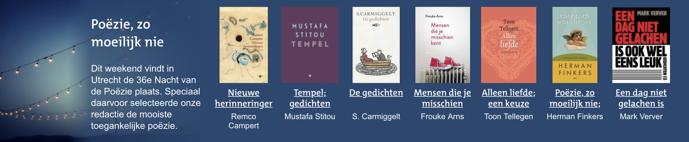
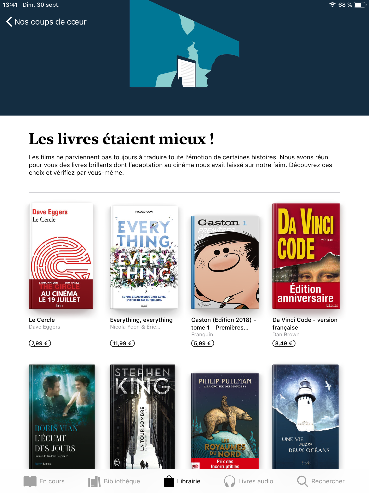
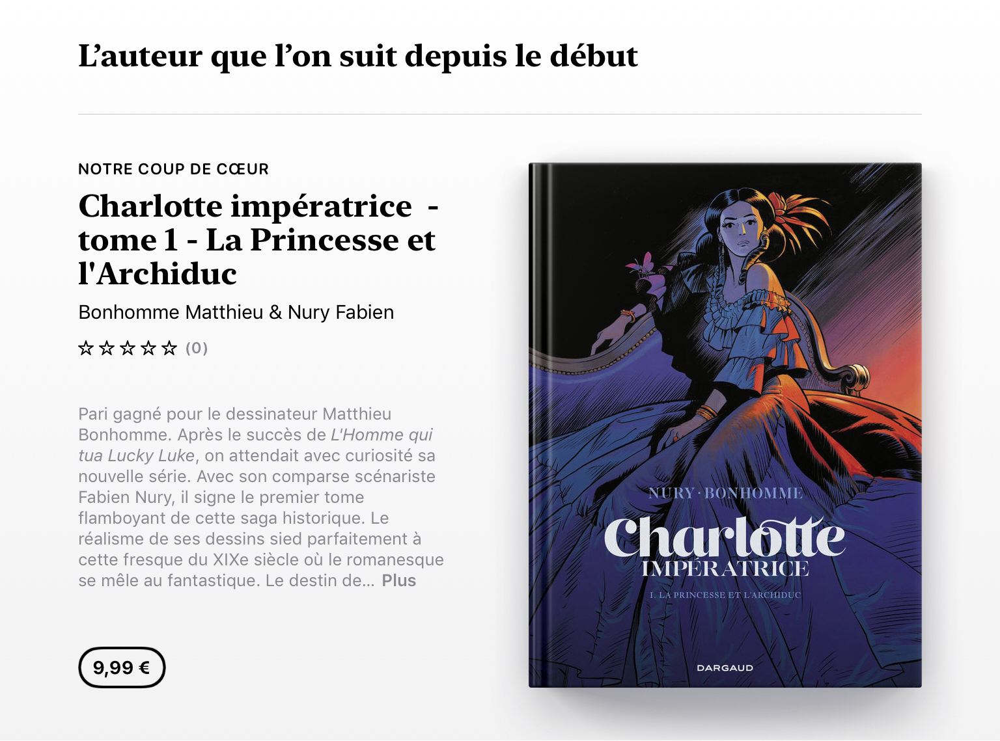
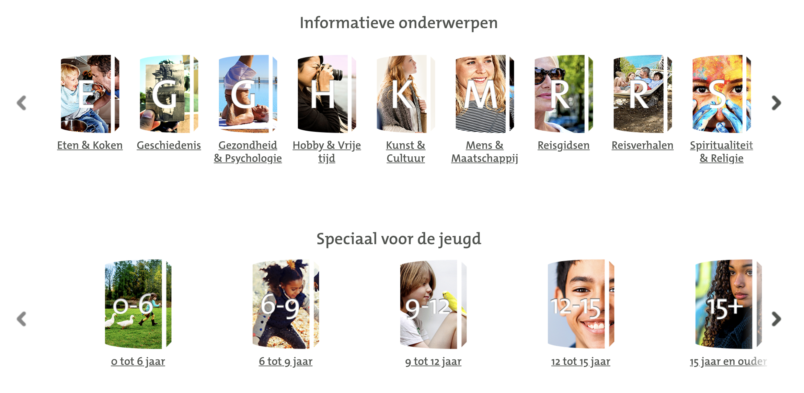
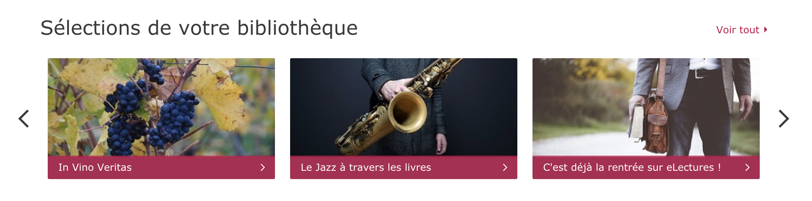

# Additional Semantics for Presenting Content in OPDS 2.0

OPDS 2.0 introduced the concept of groups, which is incredibly useful for creating content rich pages.

But with only two types of groups (navigation & publication), our ability to present content in an attractive way is a bit lacking compared to other platforms out there.

The idea behind this document is to explore how various platforms introduce visual diversity in how content is presented and suggest how we could introduce similar concepts in OPDS.

To maximize compability with existing parsers and clients, these extensions should be designed as progressive enhancements, that would enhance the visual presentation without disrupting the UX dramatically.

## 1. Rankings

*Relevant for feeds & groups.*


Rankings are faily common in catalogs (mostly for best selling/most popular publications) and could be identified in either a feed or a group to trigger:

* the position of each publication in the ranking
* and eventually present publications slightly differently 

Potential syntax for rankings:

```
"metadata": {
  "title": "Best Selling",
  "type": "http://opds-spec.org/ranking"
}
```

## 2. Images, Background Color & Description

*Relevant for feeds & groups.*





Repeating groups without any visual element to make them unique can be "visually boring" which is why many platforms use colors or images for their background.

Both [iOS](https://developer.apple.com/design/human-interface-guidelines/ios/bars/navigation-bars/) and [Android](https://material.io/design/components/app-bars-top.html#anatomy) also provide their own recommendations for pages with a large "top navigation/app bar" which is a great fit to also provide more visual diversity.

Such bars can easily include a custom color and/or image, but there's a risk in terms of visibility for any text rendered over it.

In groups, while colors and description are an easy fit, images can be a little challenging as well due to the same visibility issues as well as finding a good fit in terms of ratio and resolution.

Colors themselves could be limited to a few values (expressed as words) which would make it easier for apps to find suitable colors for their design.

Potential syntax for these enhancements:

```
"metadata": {
  "title": "Science Fiction Flash Sale",
  "color": "blue",
  "description": "Up to -70% on selected titles"
},
"images": [
  {
    "href": "background.jpg",
    "type": "image/jpeg"
  }
]
```

## 3. Highlights

*Relevant for groups only.*




Potential syntax for highlights:

```
"groups": [
  {
    "metadata": {
      "title": "Pick of the Month",
      "type": "http://opds-spec.org/highlight"
    }
  }
]
```

## 4. Visual Navigation

*Relevant for feeds & groups.*





Potential syntax for visual navigation:

```
"navigation": [
  {
    "title": "Science Fiction",
    "href": "scifi.json",
    "type": "application/opds+json",
    "images": [
      {
        "href": "spaceship.jpg",
        "type": "image/jpeg"
      }
    ]
  }
]
```